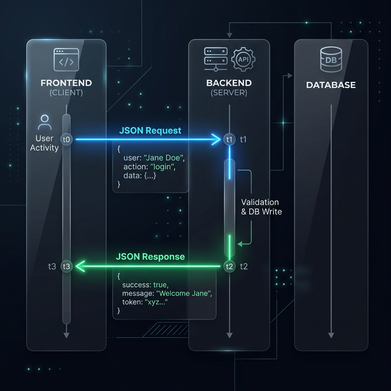

# 現代的Web開発・基礎勉強会

## Section 01: JavaScript の基礎

---

## 自己紹介

- **名前**: しゃけのきりみ。 (会津大学 学部新3年)
- **役割**: GDGoC Aizu Organizer / Web エンジニア
- **実績**:
  学園祭実行委員会の IT 部門を創設。
  受付DX、備品管理システム、インフラ構築などを経験。

---

## この勉強会のゴール

この勉強会では **JavaScript** と **TypeScript** を使って、
**フロントエンドからバックエンドまで、Web アプリを一通り作れるようになる** ことを目指します。

Section 01 では、まず JavaScript の基本文法を押さえます。

---

## 1. JavaScript とは

---

### Web を動かす言語

JavaScript は **Web ブラウザ上で動作するプログラミング言語** として誕生しました。
現在はサーバーサイド（Node.js）でも広く使われています。

- **動的型付け**
- **インタプリタ型**（コンパイル不要でそのまま実行可能）
- **イベント駆動・非同期処理** が得意

---

### ⚠️ Java と JavaScript は全くの別物

名前が似ていますが、**まったく関係のない別の言語** です。

| 　             | **JavaScript**         | **Java**                       |
| :------------- | :--------------------- | :----------------------------- |
| **用途**       | Web サイト・Web アプリ | 業務系システム・Android アプリ |
| **動く場所**   | ブラウザ / Node.js     | JVM（専用の実行環境）          |
| **型システム** | 動的型付け             | 静的型付け                     |

> 「**ハム**」と「**ハムスター**」くらい違います。

---

## 2. 変数宣言: `const` と `let`

---

### 再代入 (Reassignment) とは

変数（データを入れる箱）に、あとから別の値で上書きすることを **「再代入」** と呼びます。
JavaScriptでは、この「再代入ができるかどうか」で変数の作り方が2種類に分かれます。

---

### `const` — 再代入不可

```javascript
const name = "Shake";
// name = "Taro";  ← TypeError: Assignment to constant variable.
```

### `let` — 再代入可能

```javascript
let score = 0;
score = 10; // OK
score = 25; // OK
```

> **原則 `const`**。再代入が必要な場合のみ `let` を使う。
> `var` は **使いません**（再宣言ができてしまいバグの温床になるため、現代 JS では非推奨）。

---

### 再宣言 (Redeclaration) の禁止

`let` も `const` も、同じ名前の変数をもう一度作る **「再宣言」はエラー** になります。

```javascript
let score = 0;
// ❌ 同じ名前の変数をもう一度宣言しようとしている
let score = 100; // SyntaxError: Identifier 'score' has already been declared
```

---

### セミコロンについて

JavaScript ではセミコロン `;` は **省略可能** です。
ASI（Automatic Semicolon Insertion）という仕組みで自動挿入されます。

```javascript
const a = 1; // セミコロンなしでも動く
const b = 2; // 書いても OK
```

> プロジェクトによって統一ルールが異なります。この勉強会では **省略なし** で統一します。

---

## 3. データ型

---

### 型（Type）とは？

型とは、**データの種類を分類する仕組み** です。
型によって、そのデータに対して **何ができるか** が決まります。

```c
// C言語 — 型を明示的に宣言する（静的型付け）
int age = 21;          // int（整数）と宣言
age = "hello";         // ❌ コンパイルエラー！
```

```python
# Python — 型の宣言は不要だが、型は厳格に区別される
age = 21               # int
age = "hello"          # OK（変更できる）
print("age: " + 21)    # ❌ TypeError！ 文字列と数値は足せない
```

> 多くの言語では型を厳密に管理しますが、JavaScript は少し事情が違います。

---

### JavaScript の型は「曖昧」

JavaScript は **動的型付け** の言語です。変数に型の宣言が不要で、途中で型が変わっても怒られません。

```javascript
let value = 42; // number
value = "hello"; // string に変わる — エラーにならない！
value = true; // boolean にも変わる — まだ怒られない
```

さらに、異なる型同士の演算で **暗黙の型変換** が起きます。

```javascript
console.log("5" + 3); // "53"（数値が文字列に変換され連結）
console.log("5" - 3); // 2   （文字列が数値に変換され減算）
console.log(true + 1); // 2   （true が 1 に変換される）
```

> この曖昧さが大規模開発でバグの温床になるため、**TypeScript**（型を明示する仕組み）が生まれました。TypeScript は次のセクションで学びます。

---

### プリミティブ型 (最初からいるやつ)

```javascript
// string（文字列）
const greeting = "こんにちは";

// number（数値）— 整数も小数も同じ型
const age = 21;
const pi = 3.14;

// boolean（真偽値）
const isStudent = true;

// null — 意図的に「値がない」ことを示す
const data = null;

// undefined — 値が未設定の状態
let x;
console.log(x); // undefined
```

---

### 3 種類のクォート

JavaScript には文字列を囲む記号が **3つ** あります。

|  記号   | 名前             | `${}` 展開 | 改行 |
| :-----: | :--------------- | :--------: | :--: |
|   `"`   | ダブルクォート   |     ❌     |  ❌  |
|   `'`   | シングルクォート |     ❌     |  ❌  |
| `` ` `` | バッククォート   |     ✅     |  ✅  |

```javascript
const name = "Shake"; // ダブルクォート
const name2 = "Shake"; // シングルクォート（機能は同じ）
const msg = `Hi, ${name}`; // バッククォート（${}が使える！）
```

> `"` と `'` は **完全に同じ** 機能。プロジェクト内で統一すれば OK。
> `` ` `` だけが特別で、`${}` と改行が使えます。

---

### string の基本操作

```javascript
const greeting = "Hello, World!";

// 長さを取得
console.log(greeting.length); // 13

// 特定の位置の文字を取得（0 から数える）
// C言語のchar配列と同じ感覚でOK
console.log(greeting[0]); // "H"
console.log(greeting[7]); // "W"

// 文字列を連結
console.log("Hello" + ", " + "JS"); // "Hello, JS"

// 文字列が含まれているか
console.log(greeting.includes("World")); // true
console.log(greeting.includes("Java")); // false
```

---

### string の便利メソッド

```javascript
const text = "  Hello, JavaScript!  ";

// 大文字・小文字変換
console.log("hello".toUpperCase()); // "HELLO"
console.log("HELLO".toLowerCase()); // "hello"

// 前後の空白を除去
console.log(text.trim()); // "Hello, JavaScript!"

// 一部を切り出し（開始位置, 文字数）
console.log("JavaScript".slice(0, 4)); // "Java"

// 文字を置き換え
console.log("I like cats".replace("cats", "dogs"));
// "I like dogs"

// 分割して配列にする
console.log("a,b,c".split(",")); // ["a", "b", "c"]
```

---

### テンプレートリテラル：連結と展開

`+` 記号でも文字は繋げますが、現代では **バッククォート `` ` ``** を使います。

- **`'` / `"`**: 単なる文字列の塊。中に変数を書いても展開されません。
- **`` ` ``**: 中に **`${変数名}`** と書くと、そこに「変数の中身」が展開（代入）されます。

```javascript
const name = "Shake";
const age = 20;

// + で連結（読みにくい…）
const msg1 = name + "さんは" + age + "歳です";

// ❌ シングル/ダブルクォートだと展開されない！
console.log('${name}さんは${age}歳です'); // 文字通り "${name}さんは${age}歳です" と表示される

// ✅ バッククォートの中で ${} を使うと変数の値が埋め込まれる！
console.log(`${name}さんは${age}歳です`); // "Shakeさんは20歳です" と表示される
```

`${}` は文字列の中に開いた **「小窓」** だと思ってください。
小窓の中に変数名を書くと、その値が自動的に埋め込まれます。

---

### テンプレートリテラル：改行と式

```javascript
// 改行もそのまま書ける（+ で連結する必要がない）
const html = `
  <div>
    <h1>Hello</h1>
    <p>Welcome!</p>
  </div>
`;

// ${} の中には式（計算）も書ける
const price = 1000;
const tax = 0.1;
console.log(`税込: ${price * (1 + tax)}円`); // 税込: 1100円
```

---

### number と演算

```javascript
console.log(10 + 3); // 13
console.log(10 - 3); // 7
console.log(10 * 3); // 30
console.log(10 / 3); // 3.333...
console.log(10 % 3); // 1（剰余）
console.log(2 ** 10); // 1024（べき乗）
```

> 整数(Integer)と浮動小数点(Float)の区別はありません。すべて `number` 型（IEEE 754 倍精度）です。

---

### 型の確認: `typeof`

```javascript
console.log(typeof "hello"); // "string"
console.log(typeof 42); // "number"
console.log(typeof true); // "boolean"
console.log(typeof undefined); // "undefined"
```

---

## 4. 比較演算子

---

### `==`（等価演算子）

`==` は値を比較しますが、**型が違うと暗黙の型変換** を行います。

```javascript
console.log("100" == 100); // true  ← 文字列が数値に変換される
console.log(0 == false); // true  ← 0 が false として扱われる
console.log("" == 0); // true  ← 空文字が 0 として扱われる
```

直感に反する結果が多く、**バグの原因** になります。

---

### `===`（厳密等価演算子）

`===` は **値と型の両方** を比較します。型変換は一切行いません。

```javascript
console.log(5 === 5); // true
console.log(5 === "5"); // false（型が違うのでfalse）
console.log(0 === false); // false（number と boolean は別）
```

> 基本的にはこっちを使いましょう。

---

### 大小比較

```javascript
console.log(10 > 5); // true
console.log(10 < 5); // false
console.log(10 >= 10); // true
console.log(10 <= 9); // false
```

---

## 5. 論理演算子

---

### falsy と truthy

JavaScript では、boolean 以外の値も **条件式で true/false として扱われます**。

**falsy（false として扱われる値）** は以下の **7つだけ**：

| 値          | 型               |
| :---------- | :--------------- |
| `false`     | boolean          |
| `0`         | number           |
| `-0`        | number           |
| `""`        | string（空文字） |
| `null`      | null             |
| `undefined` | undefined        |
| `NaN`       | number           |

---

**falsyな値以外はすべて truthy**（`"0"`, `[]`, `{}` なども truthy）

```javascript
if ("hello") console.log("truthy!"); // 表示される
if ("") console.log("truthy!"); // 表示されない（falsy）
if (0) console.log("truthy!"); // 表示されない（falsy）
if (42) console.log("truthy!"); // 表示される
```

---

### AND / OR / NOT

```javascript
// AND（かつ）— すべて true なら true
const canBuy = hasStock && hasMoney;

// OR（または）— どちらか true なら true
const canEnter = isMember || hasTicket;

// NOT（否定）— 反転
const isNotReady = !isReady;
```

---

### ショートサーキット評価

```javascript
// AND: 左が false なら右を評価しない
false && expensiveFunction(); // expensiveFunction は呼ばれない

// OR: 左が true なら右を評価しない
true || expensiveFunction(); // expensiveFunction は呼ばれない

// デフォルト値の設定に使える
const port = process.env.PORT || 3000;
```

---

### Nullish Coalescing (`??`)

`||` は `0` や `""` も falsy として扱ってしまいます。
`??` は **`null` と `undefined` のみ** をフォールバック対象にします。

```javascript
const count = 0;
console.log(count || 10); // 10（0 は falsy）
console.log(count ?? 10); // 0 （0 は null でも undefined でもない）
```

---

## 6. null と undefined

---

### 2つの「ない」

| 　         | `undefined`                        | `null`                   |
| :--------- | :--------------------------------- | :----------------------- |
| **意味**   | 値が未設定（システム的）           | 「値がない」ことを表す   |
| **発生**   | 変数宣言直後、存在しないプロパティ | 下記参照                 |
| **typeof** | `"undefined"`                      | `"object"`（歴史的バグ） |

```javascript
let a;
console.log(a); // undefined（宣言のみ）

const b = null;
console.log(b); // null
```

> **発音の豆知識**:
> 英語では「**ナル**」(nuhl) に近い発音ですが、日本では「**ヌル**」と呼ぶのが一般的です。どちらでも通じますが、現場では「ヌル」をよく耳にします。

---

### null はどこからやってくる？

自分で `null` をセットすることもありますが、**外部から返ってくる** ことも多いです。

```javascript
// DOM 操作 — 要素が見つからないと null
const el = document.getElementById("not-exist"); // null

// API レスポンス — 値がないフィールドが null
const user = { name: "Shake", nickname: null };

// React — state の初期値を null にするパターン
const [data, setData] = useState(null);
```

> `null` が来る可能性を **常に意識する** ことが、バグを防ぐ第一歩です。

---

## 7. 命名規則

---

### キャメルケース（camelCase）

変数・関数には **camelCase** を使います。
頭文字は小文字で、2単語目以降の頭文字を大文字にします。

```javascript
const firstName = "Taro";
const isLoggedIn = true;
const fetchUserData = () => {
  /* ... */
};
```

---

### パスカルケース（PascalCase）

クラス名・コンポーネント名・型名には **PascalCase** を使います。
頭文字も大文字で、2単語目以降の頭文字も大文字にします。

```javascript
class UserProfile {
  /* ... */
}
// React コンポーネント
function StudentList() {
  /* ... */
}
```

---

### ローマ字はあまり良くない

```javascript
// ❌
const namae = "しゃけ";
const gakuseiId = "U001";

// ✅
const name = "しゃけ";
const studentId = "U001";
```

> 英単語が浮かばなければ **Google 翻訳** や **Gemini** に聞きましょう。
> 開発現場や人によってはOKな場合もありますが...

---

### 意味のある名前をつける

```javascript
// ❌ 何が入っているかわからない
const d = 100;
const x = "Taro";

// ✅ 名前から役割がわかる
const maxDiscount = 100;
const studentName = "Taro";
```

---

## 8. コメント

---

```javascript
// 1行コメント

/*
  複数行コメント
*/

const tax = 0.1; // 消費税率（2026年現在）
```

> 「何をしているか（What）」ではなく **「なぜそうしたのか（Why）」** を書く。

---

## 9. console による出力とデバッグ

---

```javascript
console.log("通常のログ");
console.warn("⚠️ 警告"); // 黄色く表示
console.error("🚨 エラー"); // 赤く表示

// 変数の中身を確認
const price = 500;
const qty = 3;
console.log("合計:", price * qty); // 合計: 1500
```

> 困ったら `console.log()` で中身を確認。これがデバッグの基本です。

---

## 10. Web アプリケーションの全体像

---

### フロントエンドとバックエンド

<div class="columns">

<div>
  
</div>

<div>

| 　       | フロントエンド        | バックエンド                 |
| :------- | :-------------------- | :--------------------------- |
| **場所** | ユーザーのブラウザ    | クラウド上のサーバー         |
| **役割** | UI 表示・ユーザー操作 | ビジネスロジック・データ保存 |
| **技術** | HTML, CSS, JS, React  | Node.js, Hono, SQL           |

</div>

</div>

---

### API — フロントとバックを繋ぐ

<div class="columns">

<div>



</div>

<div>

この **リクエスト/レスポンスの仕組み** が API です。
後半のセクションで実際に API を実装します。

</div>

</div>

---

## Section 01 まとめ

---

1. **JavaScript**: Web を動かす動的型付けの言語。Java とは無関係。
2. **変数**: `const`（再代入不可）と `let`（再代入可）。`var` は使わない。
3. **データ型**: `string`, `number`, `boolean`, `null`, `undefined`
4. **比較**: `===` / `!==` のみ使用。`==` は使わない。
5. **論理演算**: `&&`, `||`, `!`, `??`
6. **命名**: camelCase / PascalCase。ローマ字は NG。
7. **Web アプリ**: Frontend（ブラウザ）+ Backend（サーバー）+ API で構成。

---

## Next Steps

---

次回は **ロジックの構築とデータ構造** に進みます。

- **アロー関数**: 処理をまとめる「部品」の作り方
- **配列とオブジェクト**: データの集合を扱う技術
- **条件分岐・ループ**: プログラムの流れを制御する

お疲れ様でした！
